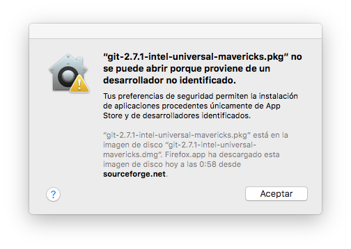
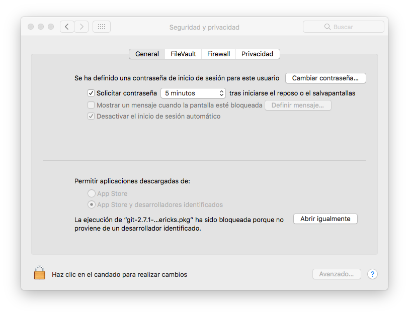

### Sistema Operativo
La instalación de las siguientes herramientas se realizará desde un sistema operativo **MacOs versión 10.12**, por lo que su información, posibles problemas y capturas de pantalla descritas están acorde a ello.
___
### Aplicaciones de desarrolladores no identificados
Al momento de instalar algunas herramientas, como Git, desde su instalador puede que tengamos que abrirlas desde Preferencias del sistema, esto es, en el caso de git, porque su instalador proviene de un desarrollador no identificado.

Para poder completar su instalación procederemos:

**Preferencias del Sistema** > **Seguridad y Privacidad** > **Abrir igualmente**

___
### Tipos de instalación
Para cada herramienta se describirá dos formas de instalación.
1. Mediante el instalador.
2. Mediante el gestor de paquetes para MacOs, **homebrew**. Podemos instalar homebrew siguiendo los pasos de su [página oficial](http://brew.sh/index_es.html).
