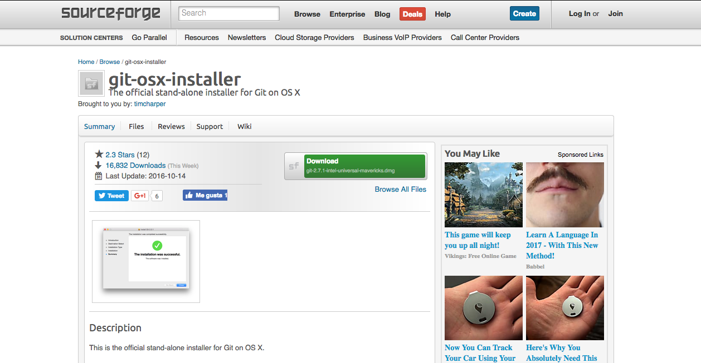
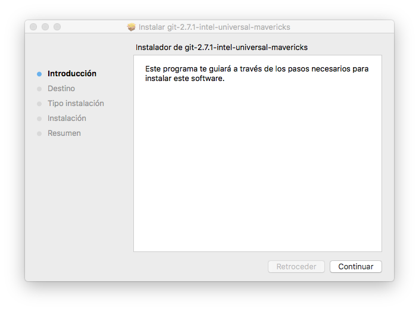

### Git
Software de control de versiones diseñado por Linus Torvalds, pensando en la eficiencia y la confiabilidad del mantenimiento de versiones de aplicaciones cuando éstas tienen un gran número de archivos de código fuente.

#### Instalación
* ##### Mediante instalador
Para la descarga del instalador de Git debemos dirigirnos a la [página en sourceforge](http://sourceforge.net/projects/git-osx-installer/).

    

    Posteriormente ejecutaremos el instalador y seguimos los pasos. En caso de que se bloquee la instalación debido a la falta de identificación del desarrollador, acuda al apartado de [aclaraciones](../aclaraciones.md).
    


* ##### Mediante homebrew
Para su instalación con homebrew ejecutaremos el siguiente comando:
```bash
$ brew install git
```

___
Para comprobar la correcta instalación de Git ejecutaremos:
```bash
$ git --version
```
obteniendo la versión de Git instalada.
