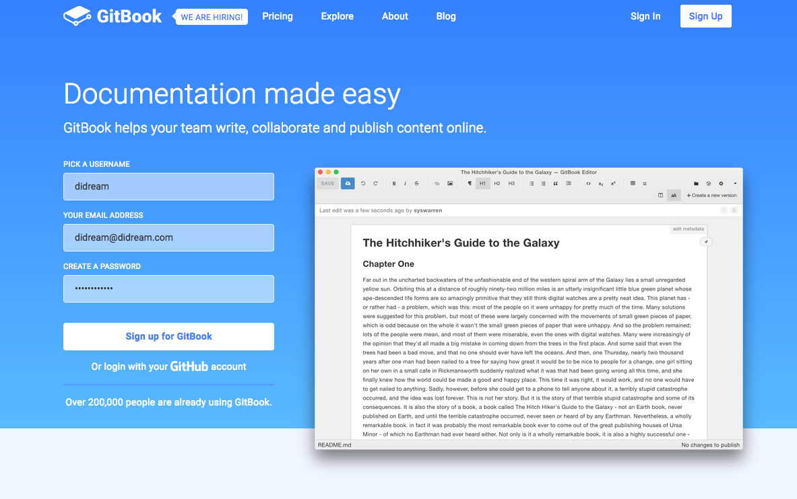

### Gitbook

GitBook es una excelente herramienta para crear documentación de proyectos y libros técnicos usando Markdown y Git/Github.

Utilizando Markdown podemos maquetar los documentos y crearlos en distintos formatos como PDF, ebook o web. Uno de los objetivos de GitBook es poder crear documentación que sea fácilmente editable y abierta a contribuciones, por eso usando Git/Github podemos publicar nuestro libro técnico y manejar las colaboraciones de forma transparente.

Para su uso debemos crearnos una cuenta desde su [página oficial](https://www.gitbook.com/).

