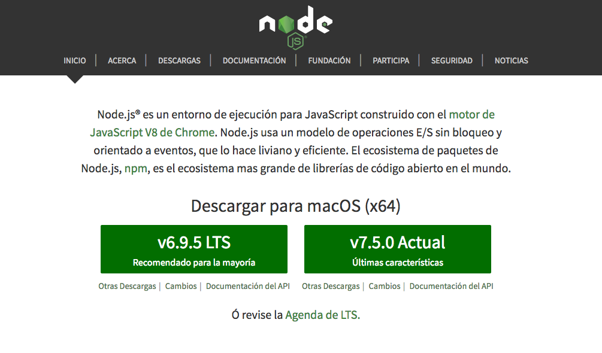
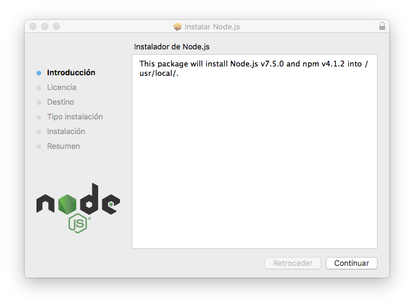
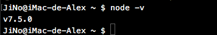

### NodeJS
Entorno JavaScript de lado de servidor que utiliza un modelo asíncrono y dirigido por eventos.

#### Instalación
* ##### Mediante instalador
Para la descarga del instalador de NodeJS debemos dirigirnos a su [página oficial](https://nodejs.org/es)



y descarga la versión mas reciente. Una vez descargado lo ejecutamos y seguimos los pasos para completar su instalación.



* ##### Mediante homebrew

Alternativamente podemos instalar NodeJS con homebrew, para ello debemos ejecutar el siguiente comando en nuestra terminal:
```bash
$ brew install node
```
___

Para comprobar su instalación ejecutaremos el comando:
```bash
$ node -v
```
obteniendo la versión de NodeJS instalada.


