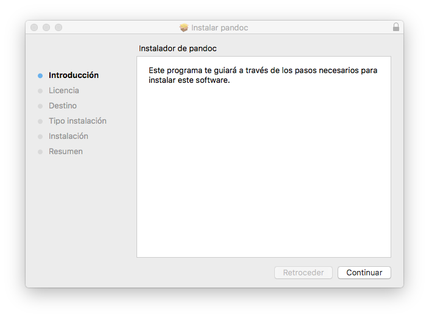

### Pandoc
Creado originalmente por John MacFarlane, un profesor de Filosofía en la Universidad de California, Berkeley, es un **conversor de documentos libre y de código abierto** capaz de soportar múltiples tipos de formatos, Markdown y HTML entre ellos.

#### Instalación
* ##### Mediante instalador
Podemos descarga el instalador desde la página en github https://github.com/jgm/pandoc/releases/tag/1.19.2.1. Posteriormente lo ejecutamos y seguimos los pasos para su instalación.
    

* #### Mediante homebrew
Ejecutaremos el comando:
```bash
$ brew install pandoc
```

___
Para comprobar si se instaló correctamente ejecutaremos el comando:
```bash
$ pandoc --version
```
obteniendo la versión de Pandoc instalada.

___
#### Uso
Una vez tengamos Pandoc instalado, podemos usarlo de dos formas: especificando el código Markdown en la línea de comandos, o especificar el nombre del archivo. Es importante saber que podemos convertir tanto de Markdown a HTML como viceversa.

* #### Por línea de comandos

Escribiremos:
```bash
$ pandoc
```
lo que iniciará Pandoc y se quedará esperando a que introduzcamos algo por teclado. Podemos introducir algo en Markdown como:
```bash
Hola *pandoc*!

- uno
- dos
```
Si pulsamos ctrl-D, le indicaremos a Pandoc que hemos acabado y traducirá el código Markdown, y nos mostrará por pantalla el código HTML resultante:
```bash
<p>Hola <em>pandoc</em>!</p>
<ul>
<li>uno</li>
<li>dos</li>
</ul>
```

Si lo queremos introducir en HTML y obtener Markdown, debemos iniciar el programa de la siguiente manera:
```bash
$ pandoc -f html -t markdown
```
y a continuación introducir nuestro código en HTML, presionar ctrl-D y obtendremos por pantalla el código Markdown.

* #### Especificando un fichero

Lo primero que debemos hacer es asegurarnos de que estamos en el directorio donde se encuentra el fichero Markdown. Para ello, podemos hacer uso del comando:
```bash
$ pwd
```
obteniendo por pantalla el directorio actual. Una vez que estemos seguros, inciaremos el programa con las siguientes opciones:
```bash
$ pandoc test1.md -f markdown -t html -s -o test1.html
```
lo que exportará el código HTML en el fichero "test1.html".

Si queremos hacerlo al contrario, bastará con cambiar el lugar de algunos argumentos:
```bash
$ pandoc test1.html -f html -t markdown -s -o test1.md
```
___


